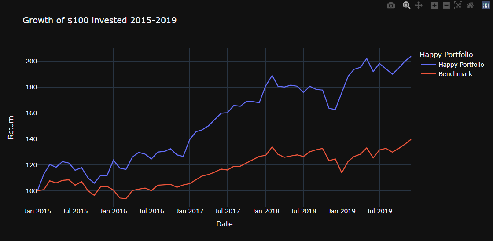

# The Happy Portfolio

In this project we are analysing a new investment portfolio, the Happy Portfolio, based on the scores of countries taken from the [World Happiness Report](https://worldhappiness.report/). We take the role of a fund manager in the early stages of launching a new investment fund. We compare the historic performance of the portfolio against a world equity index and present a decision on whether to progress with the deep analysis for the new portfolio construction. 

We read in CSV downloads for each year of the World Happiness Report and clean the data to filter out only the top 15 countries, by overall score. The data for all years is then joined together to display in one DataFrame.

Through an API, we collect the data for various country based exchange traded funds (ETFs). This data is cleaned to show only the close prices and all of the ETFs are then joined together in one DataFrame.

Using PKL files, we bring the clean data from the World Happiness Report and the ETFs into a single notebook to calculate performace. 

The portfolio is weighted by the Happiness Score of countries at the beginning of each year. The portfolio is then rebalanced annually, based on the updated scores. 

The iShares MSCI World etf is used as a benchmark to compare the portfolio. 

With an animated plot graph, we show the changes in Happiness scores over the period. To clearly present the outcomes, we use the various financial calculations and the growth of $100 as a measure with charts to illustrate our findings. 

## Data Issues

* **Some of the countries in the top 15 did not have corresponding ETFs through the API we were using.**

    We excluded Iceland, Luxembourg, Costa Rica and Puerto Rico from our data. 

    Luxembourg and Puerto Rico only appeared in the top 15 in 2 years. Iceland and Costa Rica are in the top 15 for each year in our dataset and could have a significant impact on the final outcomes.

* **The free API is limited to 100 calls.**

    We used month end data to limit the calls. The dataset would be more reliable with daily prices.

* **The performance is based on historical data.**

    We cannot predict the future, however historical trends are a good starting point to analyse the behaviour of an investment.

## Outcomes

Over the period 2015-2019 the Happy Portfolio outperformed the benchmark by 45%.

The average annual returns were 2.7% higher and the standard deviation (risk) was lower.

The distribution in returns was smaller than the benchmark and the sharpe ratio was higher, illustrating a better return on investment for the level of risk.

We strongly recommend expanding the research into this new portfolio.

The performance is shown in the below screenshot from our analysis: 



## Future releases
* Use daily data 
* Expand the dataset to include the most recent years
* Find ETFs for the missing countries
* Research the underlying ETFs and consider alternative investment options 
* Monte Carlo simulations of future performance 
* Other investment measures?
* Make the performance interactive - be able to change the investment date to rebase the growth of $100
* Create a rebalancing tool to automatically re-weight the portfolio each year

## What's in this folder?

* main_notebook - where the magic happens. The main analysis.

* Resources Folder
    * global_market_data_etfs.ipynb - API connection to the list of available etfs through the Global Market Data API. For reference only.
    * world_happiness.ipynb - pulls in and cleans the World Happiness CSVs. Creates PKL file to be accessed from main_notebook. 
    * global_market_data_api.ipynb - API pull for chosen etfs in variable ```etf_list``` and creation of pkl file to be used in the main_notebook.
    * world_happiness_csv - folder holds source CSV files
    * etf_df.pkl - pkl file of etfs created from global_market_data_etfs.ipynb
    * WH_2015_2019.pkl - pkl file of world happiness scores created from world_happiness.ipynb
 
 **Known bug:** If the main notebook encounters an error loading the pkl files, re run the code in the global_market_data_etfs.ipynb (note .env file required with API key) and world_happiness.ipynb. The pkl files must be created and opened using the same version of python.


## Technologies 

This project was built using python 3.7 with the following libraries:

* [pandas](https://github.com/pandas-dev/pandas) - For available packages within pandas.
* [pickle](https://docs.python.org/3/library/pickle.html) - For available packages within pickle.
* [functools](https://www.geeksforgeeks.org/functools-module-in-python/) - For available packages within functools.
* [plotly](https://plotly.com/python/) - For available packages within plotly.
* [requests](https://github.com/WordPress/Requests) - For available packages within requests.
* [os](https://github.com/matplotlib/matplotlib) - For available packages within matplotlib.
* [dotenv](https://github.com/motdotla/dotenv) - For available packages within dotenv.
* [json](https://www.json.org/json-en.html) - For available packages within json.

# Before running this analysis

Required: API for [Global Market Data](https://rapidapi.com/attulab-attulab-default/api/global-market-data/)
Set up free account through RapidAPI and connect to Global Market Data

.env file to hold API key in format:

X-RapidAPI-Key = "insert_key_here"
X-RapidAPI-Host = "insert_host_here"

 .env should be saved in the same folder as the main_notebook.

# Citations

[World Happiness Report](https://www.kaggle.com/datasets/unsdsn/world-happiness)
[Global Market Data](https://rapidapi.com/attulab-attulab-default/api/global-market-data/)


# Contributors 

Prospective Study created by the World-Renowned Market Research Team at Mercer-LeSieur LTD.

# License

MIT
